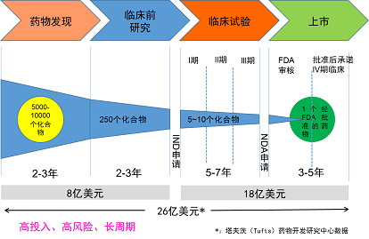

## BLOG

### 药物研发流程

1. [新药是如何从实验室走向市场的？](http://www.simm.cas.cn/kxcb/kxcb_kpwz/202002/t20200220_5502535.html)
  * 以传统的小分子化学药物为例，新药研发从无到有，要历经药物发现、临床前研究和临床试验“三部曲”，最后才能进入医药市场用于治疗疾病。细说起来可谓步步荆棘，成功者凤毛麟角。
  * 
  * 第一步：候选新药的发现
    * 候选药物的发现首先需要选择和确定药物的作用靶标。靶标是一种与某种疾病发生发展密切相关的生物分子,如蛋白和核酸等，对这种生物分子进行干预，能够治愈或缓解与其相关的疾病。
    * 药物作用的靶标确定之后，药物化学家们需要根据靶标的空间结构，设计或者合成有作用的先导化合物。
      * 可以是全新结构的化合物
      * 也可以来自天然产物（动物、植物、海洋生物）
      * 甚至还可以是一些已经上市的药物
    * 经活性筛选得到先导化合物后，还需要以先导化合物为模板合成大量的新化合物，以进行构效关系研究，进一步筛选优化得到活性更好的化合物，同时还得系统地研究化合物的理化性质，代谢性质以及毒理早期数据，才能筛选出来满足成药性的最优化合物，这时候可以作为候选药物，进入临床前开发。
  * 第二步：候选新药临床前研究
    * 临床前研究需要进行包括原料药和制剂的药学研究，动物体内的药理药效，药代动力学，以及安全性评价在内的系统研究工作，这部分研究需要在动物身上进行。
  * 第三步：临床研究
    * 在完成了系统的临床前研究后，接下来就是进入临床阶段了，临床阶段需要在人体上进行试验，因此药物进入临床研究前必须得到国家药品监督管理部门的审批。在中国，新药的研发机构需要向国家药品监督管理局（National Medical Products Administration，NMPA)提交新药临床申请（investigational new drug, IND），获得许可后才能进行人体临床试验。
    * 临床研究还需要分为四个阶段：Ⅰ期临床试验，Ⅱ期临床试验，Ⅲ期临床试验和IV期临床研究（药物上市后监测）。

  

2. [新药是怎么诞生的](https://www.boehringer-ingelheim.cn/%E8%8D%AF%E7%89%A9%E7%A0%94%E5%8F%91/%E7%A0%94%E5%8F%91/%E6%96%B0%E8%8D%AF%E6%98%AF%E6%80%8E%E4%B9%88%E8%AF%9E%E7%94%9F%E7%9A%84)

  

