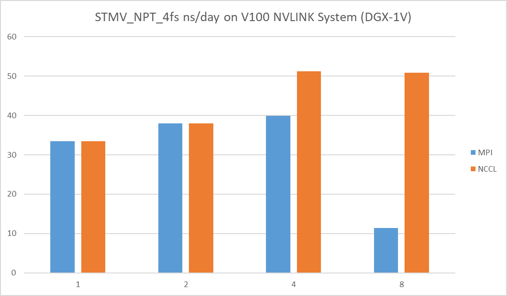

# Molecular Dynamics

 

****
 

## Amber

* ### [分子对接与分子动力学模拟在药物研发中的应用](https://www.iivd.net/thread-63985-1-1.html)
  * 分子对接(Molecular docking)与分子动力学模拟(Molecular dynamics simulation)是计算生物学中重要的一部分，在生物学研究中不断发挥着重要的作用。
  * 分子对接
    * 分子对接基本原理
      * 分子对接技术(Molecular Docking Method, MDM)是指通过计算机模拟将小分子(配体)放置于大分子靶标(受体)的结合区域，再通过计算物理化学参数预测两者的结合力(结合亲和性)和结合方式(构象)，进而找到配体与受体在其活性区域相结合时能量最低构象的方法。配体与受体结合时，彼此存在静电相互作用，氢键相互作用，范德华相互作用和疏水相互作用
    * 分子对接的分类
      * 刚性对接
      * 半柔性对接
      * 柔性对接
    * 分子对接的基本流程
      * 小分子处理
        * 大部分小分子结构可以从Pubchem/Chemspider等数据库里面下载到sdf或者pdb格式的2D/3D结构文件
      * 大分子处理
        * 大部分蛋白/酶的结构我们可以从PDB蛋白数据库进行获取，获取到的蛋白结构上往往会有多余的成分，要对蛋白进行预处理，主要是加氢、加电荷、二硫键和质子化状态方面的信息整合，其中最大的难点在于如何处理小分子周围氨基酸HIS的质子化状态，目前国际上没有一个统一的方法；对于少部分蛋白数据库中没有收录的晶体结构，可以使用Alphafold2、Rosettafold等软件进行建模获取目标蛋白结构。
      * 寻找潜在的活性位点（口袋）
      * 建立对接盒子，准备对接受体文件包
      * 选择对接精度，完成对接
    * 分子对接的应用
      * **分子对接方法可用于模拟小分子和蛋白质在原子水平上的相互作用，这使我们能够表征小分子在靶蛋白结合位点的行为，并阐明基本的生化过程**
  * 分子动力学模拟
    * 分子动力学基本原理
      * 分子动力学的算法是有限差分方法
    * 分子动力学模拟中的常用概念
      * 周期性边界条件
      * 势函数
      * 系综
      * 积分步长
    * 分子动力学模拟的基本流程
      * 评估体系
      * 选择工具
      * 软件的选择
        * 通常与软件主流使用的力场有关, 软件本身也具有一定的偏向性。
        * 蛋白体系: GROMACS, AMBER, NAMD均可；
        * DNA, RNA体系: 首选AMBER；
        * 界面体系: DL_POLY比较强大；
        * 材料体系:LAMMPS是不错的选择。
      * 力场的选择
    * 初始结构
      * 通过实验数据或者某些工具得到体系内的每一个分子的初始结构坐标文件，之后, 我们需要按我们的想法把这些分子按照一定的规则或是随机的放在一起, 从而得到整个体系的初始结构, 这也是我们模拟的输入文件。
    * 输入参数
      * 得到了结构输入文件, 我们还需要力场参数输入文件, 也就是针对我们体系的力场文件。这通常由所选用的力场决定, 包括电荷, 键合参数和非键参数等势能函数的输入参数。
    * 确定盒子
      * 体系的大小通常由你所选用的盒子大小决定. 我们必须对可行性与合理性做出评估, 从而确定体系的大小, 这依赖于具体的体系。
    * 能量最小化
    * 平衡模拟
      * 看能量(势能, 动能和总能)是否收敛；
      * 看体系的压强, 密度等等是否收敛；
      * 看体系的RMSD是否达到你能接受的范围
    * 成品模拟
    * 数据分析
  * 分子动力学模拟的应用
    * 随着对生物大分子的深入研究，靶点蛋白与小分子配体的相互作用，已经从传统认识上的“钥匙和锁”机制，转变成一种“手和手套”的诱导匹配（induce-fit）机制。这是因为科学家们逐渐认识到，蛋白质和配体的柔性使它们在相互结合时会寻求最吻合、能量最低的构象。通常情况下，我们在实现对接前需要对靶点蛋白的结构进行优化，提供较具代表性的蛋白构象；对接完成后，我们通过打分函数得到的配体蛋白复合物准确度不是很高，这时候就需要借助动力学模拟来计算结合能，验证蛋白与筛选出的小分子配体的有效结合情况；此外我们还可以借助动力学模拟研究药物与靶标蛋白的作用机理，从而为药物设计和寻找新药提供直接线索。

  

* ### [Amber 2020 Reference Manual](https://ambermd.org/doc12/Amber20.pdf)
  * 商业软件, NV不提供Docker
  * Starting with Amber 20, Amber supports use of the NVidia NCCL library for communications between multiple GPUs, which an provide a performance improvement over plain MPI. If the library is enabled (using - DNCCL=TRUE), then it will be activated when pmemd.MPI.cuda is run on 3 or more GPUs.
  * The NVIDIA Collective Communications Library (NCCL) is a library of multi-GPU collective communication primitives that are topology-aware. NCCL can be enabled when running on more than 2 GPUs in the same node. This may improve multi-GPU scaling, especially on systems with NVLINKs between GPUs. NCCL requires glibc 2.17 or higher CUDA 10.0 or higher, and runs on GPU’s with a compute capability of 3.5 (K80 equivalent) and higher..
    * To enable NCCL, first install NCCL on your system. There are two ways to install NCCL. To install NCCL from source
    * Alternatively, pre-built NCCL packages can be downloaded from NVIDIA’s website.
    * Next, the environment variable NCCL_HOME should be set to point to NCCL install path.
    * Finally, to enable NCCL in Amber, add -DNCCL=TRUE to the cmake configure options. Note NCCL build requires both MPI and CUDA to be enabled. 
    * 

  

* ### [Amber开发计划]()
  * Amber is basically a single GPU application. The multi-GPU scaling is expected to be bad. That's mainly because almost all Amber users only use single GPU to run Amber so Amber developers don't care very much about multi-GPU scaling. BTW, we integrated NCCL into Amber. So if you really want to do multi-GPU, it's recommended to turn on NCCL. See section 2.2.2 of https://ambermd.org/doc12/Amber20.pdf.
  * This is some old data on DGX-1V comparing the MPI vs NCCL for Amber multi-GPU scaling.
  * Furthermore, AFAIK, there is no current effort or plan to optimize Amber on multi-GPU.

  

* ### [155个GPU！多云场景下的Amber自由能计算](https://fastonetech.com/blog/bio-amber-and-multi-cloud/)
  * 对药物分子的虚拟筛选，仅仅实现分子对接是不够的，往往会面临一个问题就是药物分子活性的评价。许多药物和其它生物分子的活性都是通过与受体大分子之间的相互作用表现出来的，是动态的。
  * 受体和配体之间结合自由能（Binding Afinity）评价是基于结构的计算机辅助药物分子设计的核心问题。
  * 基于分子动力学（Molecular Dynamics, MD）模拟的炼金术自由能（Alchemical Free Energy，AFE）计算是提高我们对各种生物过程的理解以及加快多种疾病的药物设计和优化的关键工具。
  * MD模拟实验数据量大，计算周期长，常用软件包括Amber、NAMD、GROMACS、Schrödinger等等。GPU的并行处理技术能大大加速计算效率，所以很多MD模拟软件都开始支持GPU。
    * GROMACS作为一款开源软件，完全免费，但其成熟版本对于GPU的支持并不理想，教程相对少，对用户的要求比较高。
    * Schrödinger是商用软件，功能全面，GPU支持很好，但License是按使用核数计算的，价格相对昂贵。
    * Amber软件包包括两个部分：AmberTools和Amber
      * AmberTools可以在Amber官网免费下载和使用，Tools中包含了Amber绝大部分模块，但不支持PMEMD和GPU加速。
      * Amber是收费的，从Amber11开始支持GPU加速仿真，Amber18开始支持GPU计算自由能，且教程齐全易操作，不限制CORE的使用数量。2020年4月，已经更新到Amber20版本。

 

* ### [【分子动力学教程】分子动力学模拟（Amber 20）](https://zhuanlan.zhihu.com/p/345627471)

 

****

 

## MISC

